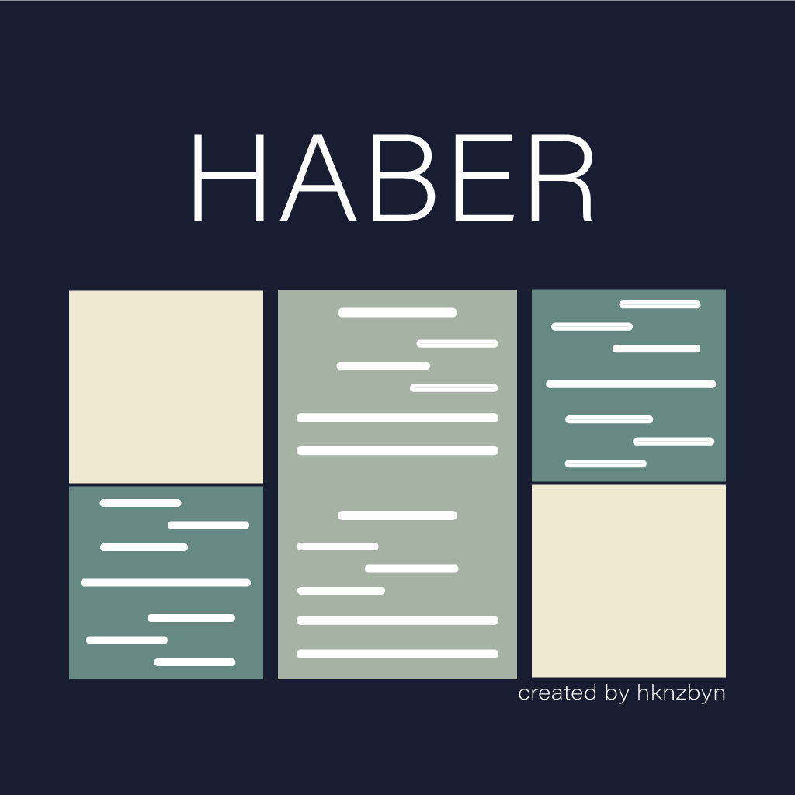

<div id="top" align="center"></div>

[](https://github.com/expo/expo)
[](https://github.com/expo/expo)
[![Issues][issues-shield]][issues-url]
[![LinkedIn][linkedin-shield]][linkedin-url]
  


<!-- PROJECT LOGO -->
<br />
<div align="center">
  <a>
    
  </a>

  <h3 align="center">News App</h3>

  <p align="center">
    NewsApp is an Ios/Android app designed for reading news using CollectApi public web service.
    <br />
    <a href="https://github.com/Hknzbyn/NewsApp"><strong>Explore the docs »</strong></a>
    <br />
    <br />
     <br >
    <a href="https://github.com/Hknzbyn/NewsApp/issues">Report Bug</a>
    <br />
  </p>
</div>

<!-- ABOUT THE PROJECT -->
## About The Project
[](https://www.youtube.com/watch?v=JnF0u_bI1Ig)


<div style="white-space: nowrap;height:500px;overflow-y:hidden;overflow-x:auto;">


</div>
<p align="right">(<a href="#top">back to top</a>)</p>


## Installation
First, make sure you have Expo CLI installed:
```
npm install -g expo-cli
```
Clone:
```
git clone https://github.com/Hknzbyn/NewsApp.git
```
Navigate to the project directory:
```
cd NewsApp
```
Install: 
```
npm install || yarn || yarn install
```
Run Project Locally:
```
expo start || npm run start || yarn start
```
For to get your key [API Link](https://collectapi.com/api/news/haberler-api) // or use it my free key
```
let auth = 'YOUR_KEY'
```

<!-- CONTACT -->
## Contact

Hakan Özbeyen - [@Linkedin](https://www.linkedin.com/in/hakanozbeyen) 

Project Link: [https://github.com/Hknzbyn/NewsApp](https://github.com/Hknzbyn/NewsApp)

<p align="right">(<a href="#top">back to top</a>)</p>


<!-- MARKDOWN LINKS & IMAGES -->
<!-- https://www.markdownguide.org/basic-syntax/#reference-style-links -->


[issues-shield]: https://img.shields.io/github/issues/Hknzbyn/NewsApp.svg?style=for-the-badge
[issues-url]: https://github.com/Hknzbyn/NewsApp/issues
[stars-shield]: https://img.shields.io/github/stars/Hknzbyn/NewsApp.svg?style=for-the-badge
[stars-url]: https://github.com/Hknzbyn/NewsApp/stargazers
[linkedin-shield]: https://img.shields.io/badge/-LinkedIn-black.svg?style=for-the-badge&logo=linkedin&colorB=555
[linkedin-url]: https://www.linkedin.com/in/hakanozbeyen
[product-screenshot]: images/screenshot.png
